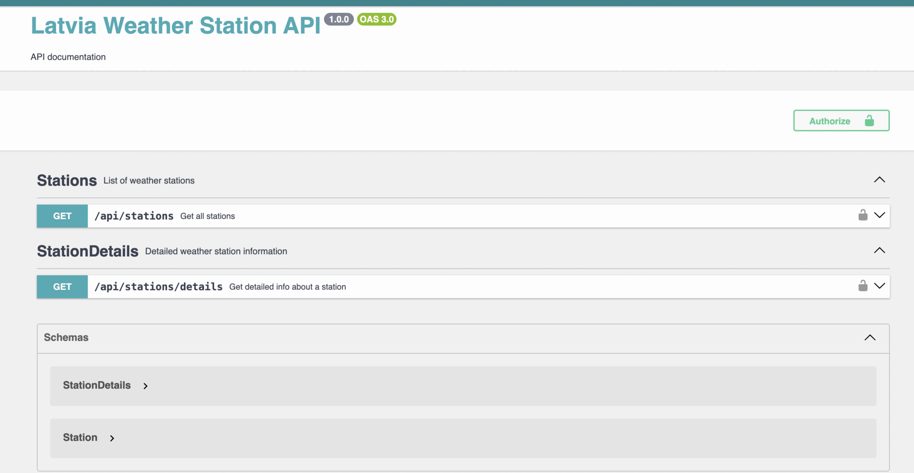

# Latvia Weather Station API

This project is a Symfony-based REST API service providing weather station data for Latvia. It downloads station data in CSV format, imports it into a database, and exposes endpoints for querying station information.

---


## Requirements

- Docker and Docker Compose installed
- PHP 8.3 (inside Docker container)
- Composer

---

## Installation
Clone the repository:

```bash
  git clone <git@github.com:Aleksandrs001/latvia-weather-station-api.git>
  cd latvia-weather-station-api
```
---
# Install dependencies and build Docker containers:

  ```bash
    make install
  ```
---
# Usage
Run the full workflow
This command runs database migrations, downloads the latest CSV weather station data, and imports it into the database:

```bash
  make run
```
---
# Run individual steps
Download the weather station CSV file:

```bash
  make app-download-weather-data
```
---
Import stations from the CSV file into the database:
```bash
  make app-import-stations
```
---

# For Automated daily updates, you can set up a cron job to run the following command:

0 0 * * * docker exec -i weather-php php bin/console app:download-csv && docker exec -i weather-php php bin/console app:import-csv >> /path/to/project/var/log/daily_update.log 2>&1

---

# Open a bash shell inside the PHP container:

```bash
  make bash
```
---
Running Tests
Run unit tests for the StationImporter service:

```bash
  make unit-test-StationImporter
```
---

Run unit tests for the API controller:

```bash
  make unit-test-StationController
```

---
# API Endpoints

GET /api/stations
Returns a JSON array of all weather stations.

GET /api/stations/details?stationId={station_id}
Returns detailed information about a specific weather station.

---

## API Documentation

After starting the application, you can view the OpenAPI (Swagger) documentation in your browser at:

[http://localhost:8080/api/doc](http://localhost:8080/api/doc)

---

# Authentication
All endpoints require Bearer JWT authentication via the Authorization header.

### ** Bearer token = super-secret-token**

---

# Project Structure Highlights
src/Service/StationImporter.php — Service to parse CSV data and import stations into DB
src/Controller/StationController.php — API controller with station endpoints
tests/Service/StationImporterTest.php — Unit tests for importer
tests/Controller/StationControllerTest.php — Unit tests for controller

---

# Makefile 
Contains commands to build, run, and test the project

---

# Configuration
The PHP Docker container is named weather-php by default; change in Makefile if needed.

---

# API documentation
Uses NelmioApiDocBundle with OpenAPI annotations.

---
